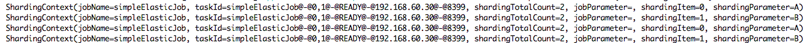

这一部分是如何在本地搭建一个可以玩耍的elastic-job系统。

# ZooKeeper

为了方便和使用更少资源的目的，这里使用一台机器组成的standalone模式。配置只需要修改`zoo.cfg`的`dataDir`一项即可，如下:

```shell
dataDir=/Users/zhaoxudong/softwares/zookeeper-3.4.12/data
```

然后在bin目录下执行:

```shell
./zkServer.sh start
```

然后通过命令:

```shell
./zkServer.sh status	
```

可以看到启动成功。

# 中心?

Elastic-job-lite是一个无中心的结构，所以没有一个类似于任务配置中心的东西，所以集群的配置到这里就完事了。

# 测试配置

为了方便测试，最好在本地启用这项参数:

```java
// 为了方便测试，这里每次都用本地配置覆盖远程配置
LiteJobConfiguration liteJobConfiguration = 
    LiteJobConfiguration.newBuilder(simpleJobConfiguration)
        .overwrite(true)
        .build();
```

否则本地改了参数重新启动还是然并卵。

在使用两个分片，分片参数是:

```java
0=A,1=B
```

的情况下，任务执行如下:

