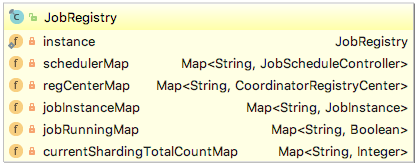
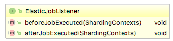
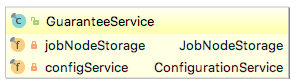
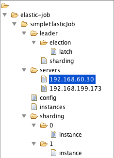
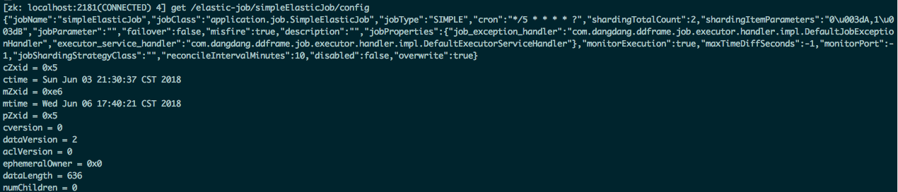
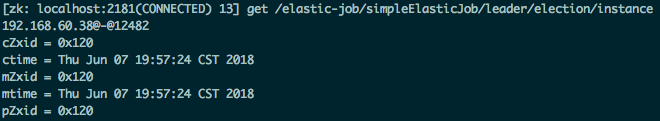
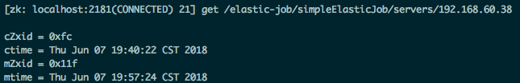
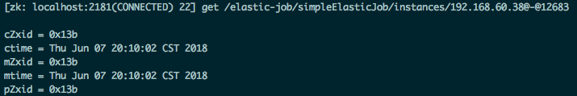
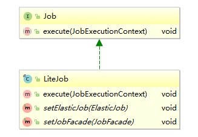
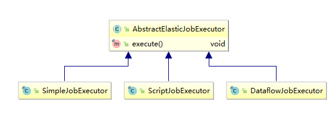

# Zookeeper连接

当系统启动时，首先做的便是zookeeper的连接，这一步在ZookeeperRegistryCenter的init方法中完成，源码精简为:

```java
@Override
public void init() {
    CuratorFrameworkFactory.Builder builder = CuratorFrameworkFactory.builder()
            .connectString(zkConfig.getServerLists())
            .namespace(zkConfig.getNamespace());
    
    client = builder.build();
    client.start();

    int maxWaitTime = zkConfig.getMaxSleepTimeMilliseconds() * zkConfig.getMaxRetries();
    if (!client.blockUntilConnected(maxWaitTime, TimeUnit.MILLISECONDS)) {
            
        client.close();
        throw new KeeperException.OperationTimeoutException();
    }
}
```

代码很简单，这里使用了Apache Curator。

# 初始化

## JobScheduler

JobScheduler是elastic-job-lite中核心的对象，负责job的注册、启动等。代码分布在其构造器和init方法中，下面根据功能点进行说明。

## Job实例创建

```java
private JobScheduler(final CoordinatorRegistryCenter regCenter, 
                     final LiteJobConfiguration liteJobConfig, 
                     final JobEventBus jobEventBus, 
                     final ElasticJobListener... elasticJobListeners) {
    JobRegistry.getInstance().addJobInstance(
        liteJobConfig.getJobName(), new JobInstance()
    );
}
```

### JobRegistry

这货是负责本地各种任务相关的映射信息，下面是其类图：



addJobInstance便是将初始化的任务信息放到jobInstanceMap中。JobInstance中包含了任务的String类型的唯一ID，其生成方法:

```java
public JobInstance() {
	jobInstanceId = IpUtils.getIp() + DELIMITER + 
            ManagementFactory.getRuntimeMXBean().getName().split("@")[0];
}
```

所以：**ID由IP + 进程号的方式组成**。

## ElasticJobListener

elastic-job留下的允许我们监控任务的启动和结束的接口：



## GuaranteeService

前面说的Job实例创建只是本地的对象操作，尚未与zookeeper有交互。GuaranteeService从作者的角度来说叫做

> 保证分布式任务全部开始和结束状态的服务.

但是个人觉着更准确来说是**封装了任务节点的数据访问和配置**。如下：



JobScheduler构造器通过调用setGuaranteeServiceForElasticJobListeners方法创建了一个此对象：

```java
private void setGuaranteeServiceForElasticJobListeners(final CoordinatorRegistryCenter regCenter, 
                                                       final List<ElasticJobListener> elasticJobListeners) {
    GuaranteeService guaranteeService = new GuaranteeService(regCenter, liteJobConfig.getJobName());
    for (ElasticJobListener each : elasticJobListeners) {
        if (each instanceof AbstractDistributeOnceElasticJobListener) {
            ((AbstractDistributeOnceElasticJobListener) each).setGuaranteeService(guaranteeService);
        }
    }
}
```

此对象最终只能被AbstractDistributeOnceElasticJobListener(只执行一次的监听器)引用到。

## 门面

### 调度器

即SchedulerFacade类，其构造器创建了一大坨Service:

```java
public SchedulerFacade(final CoordinatorRegistryCenter regCenter, final String jobName, final List<ElasticJobListener> elasticJobListeners) {
    this.jobName = jobName;
    configService = new ConfigurationService(regCenter, jobName);
    leaderService = new LeaderService(regCenter, jobName);
    serverService = new ServerService(regCenter, jobName);
    instanceService = new InstanceService(regCenter, jobName);
    shardingService = new ShardingService(regCenter, jobName);
    executionService = new ExecutionService(regCenter, jobName);
    monitorService = new MonitorService(regCenter, jobName);
    reconcileService = new ReconcileService(regCenter, jobName);
    listenerManager = new ListenerManager(regCenter, jobName, elasticJobListeners);
}
```

估计后续的操作都要依赖于这些Service完成。

### Job

即LiteJobFacade，也有一坨Service:

```java
public LiteJobFacade(final CoordinatorRegistryCenter regCenter, final String jobName, final List<ElasticJobListener> elasticJobListeners, 
                     final JobEventBus jobEventBus) {
    configService = new ConfigurationService(regCenter, jobName);
    shardingService = new ShardingService(regCenter, jobName);
    executionContextService = new ExecutionContextService(regCenter, jobName);
    executionService = new ExecutionService(regCenter, jobName);
    failoverService = new FailoverService(regCenter, jobName);
    this.elasticJobListeners = elasticJobListeners;
    this.jobEventBus = jobEventBus;
}
```

# 注册

从这里便开始与zookeeper有交互了。

## 任务配置

即:

```java
public void init() {
    LiteJobConfiguration liteJobConfigFromRegCenter = schedulerFacade.updateJobConfiguration(liteJobConfig);
}
```

这里的逻辑可以概括为：

1. 如果ZK上此任务已经存在(比如重启)并且没有启用覆盖，那么将以ZK的配置为准。
2. 否则以本地为准。

SchedulerFacade.updateJobConfiguration:

```java
public LiteJobConfiguration updateJobConfiguration(final LiteJobConfiguration liteJobConfig) {
	configService.persist(liteJobConfig);
	return configService.load(false);
}
```

persist方法实现:

```java
public void persist(final LiteJobConfiguration liteJobConfig) {
    checkConflictJob(liteJobConfig);
    if (!jobNodeStorage.isJobNodeExisted(ConfigurationNode.ROOT) || liteJobConfig.isOverwrite()) {
        jobNodeStorage.replaceJobNode(ConfigurationNode.ROOT, LiteJobConfigurationGsonFactory.toJson(liteJobConfig));
    }
}
```

zookeeper的存储结构如下:



config节点保存的数据其实就是LiteJobConfiguration对象序列化后得到的JSON串，如下图：



## Quartz调度器

elastic-job本地基于Quartz实现，这一步便是创建一个Quartz调度器，实现位于JobScheduler的init方法:

```java
JobScheduleController jobScheduleController = new JobScheduleController(
    createScheduler(), createJobDetail(liteJobConfigFromRegCenter.getTypeConfig().getJobClass()), 
    liteJobConfigFromRegCenter.getJobName()
);
```

核心为createScheduler方法:

```java
private Scheduler createScheduler() {
    Scheduler result;
    try {
        StdSchedulerFactory factory = new StdSchedulerFactory();
        factory.initialize(getBaseQuartzProperties());
        result = factory.getScheduler();
      result.getListenerManager().addTriggerListener(schedulerFacade.newJobTriggerListener());
    } catch (final SchedulerException ex) {
        throw new JobSystemException(ex);
    }
    return result;
}
```

没啥好说的。

## 任务监听

这一步是启动对任务根路径的监听，在这里就是/elastic-job/simpleElasticJob:

```java
@Override
public void addCacheData(final String cachePath) {
    TreeCache cache = new TreeCache(client, cachePath);
    cache.start();
}
```

## 启动信息

SchedulerFacade.registerStartUpInfo:

```java
public void registerStartUpInfo(final boolean enabled) {
    listenerManager.startAllListeners();
    leaderService.electLeader();
    serverService.persistOnline(enabled);
    instanceService.persistOnline();
    shardingService.setReshardingFlag();
    monitorService.listen();
    if (!reconcileService.isRunning()) {
        reconcileService.startAsync();
    }
}
```

这里的信息量略大。

### 监听器

```java
public void startAllListeners() {
    electionListenerManager.start();
    shardingListenerManager.start();
    failoverListenerManager.start();
    monitorExecutionListenerManager.start();
    shutdownListenerManager.start();
    triggerListenerManager.start();
    rescheduleListenerManager.start();
    guaranteeListenerManager.start();
    jobNodeStorage.addConnectionStateListener(regCenterConnectionStateListener);
}
```

这些监听器负责对zookeeper节点数据变化的处理，后面再对这一部分详细展开。

### 选主

利用Curator选主的代码如下:

```java
public void executeInLeader(final String latchNode, final LeaderExecutionCallback callback) {
    try (LeaderLatch latch = new LeaderLatch(getClient(), jobNodePath.getFullPath(latchNode))) {
        latch.start();
        latch.await();
        callback.execute();
    } catch (final Exception ex) {
        handleException(ex);
    }
}
```

选主利用的是`/elastic-job/simpleElasticJob/leader/election/latch`节点，如果当前节点成为主节点，那么将任务ID保存到`/elastic-job/simpleElasticJob/leader/election/instance`节点，如下图:



### Server上线

这一步是标记当前节点处于上线状态，其实就是建立一个如下节点，节点值为空串:



### 任务上线

这一步建立了一个如下**临时**节点:



作用感觉和上面略有重叠，有待后续确认。

### 分片标记

指的是持久化节点`/elastic-job/simpleElasticJob/leader/sharding/necessary`，值为空，标志需要重新分片，具体作用后面确认。

### 调解服务

指的是ReconcileService会启动对节点`/elastic-job/simpleElasticJob/config`的监听，前面提到过，此节点保存的是任务的配置JSON，调解的原理后面再详细介绍。

# 启动

位于JobScheduler.init:

```java
public void init() {
 jobScheduleController.scheduleJob(liteJobConfigFromRegCenter.getTypeConfig().getCoreConfig().getCron());
}
```

这里其实就是在本地启动了Quartz去执行:

```java
public void scheduleJob(final String cron) {
    if (!scheduler.checkExists(jobDetail.getKey())) {
        scheduler.scheduleJob(jobDetail, createTrigger(cron));
    }
    scheduler.start();
}
```

# 执行机制

前面讲任务的启动当作了一个黑盒子，其实里面包含了相当多的信息。Quartz其实根据我们指定的任务类去执行相应的回调方法，然而这里设置的任务类并不是我们前面自定义的SimpleElasticJob，而是:



Job是Quartz提供的任务抽象接口，显然LiteJob的execute方法便是入口了:

```java
@Override
public void execute(final JobExecutionContext context) throws JobExecutionException {
    JobExecutorFactory.getJobExecutor(elasticJob, jobFacade).execute();
}
```

## 执行器



所以创建任务执行器的逻辑也就可以想象的到了：根据任务的类型去创建对应的执行器。

## 时差检测

当我们设置了本地时间和ZK时间差检查时，在每次任务执行前会进行此检查，开启的方法如下:

```java
LiteJobConfiguration liteJobConfiguration = LiteJobConfiguration.newBuilder(simpleJobConfiguration)
                .overwrite(true)
                .maxTimeDiffSeconds(10)
                .build();
```

这里只需要弄清楚一点，**系统是如何获取ZK时间的**。

```java
@Override
public long getRegistryCenterTime(final String key) {
    long result = 0L;
    persist(key, "");
    result = client.checkExists().forPath(key).getMtime();
    return result;
}
```

Zookeeper中mtime属性表示节点的最后修改时间，所以先创建一个节点，然后获取其最后修改时间，也就是Zookeeper的时间了。

这里被创建的节点的路径是：`/elasticjob/simpleElasticJob/simpleElasticJob/systemTime/current`

## 单线程调度

Elastic-job本地的任务调度实际上只由一个线程完成，JobScheduler.createScheduler:

```java
private Scheduler createScheduler() {
    StdSchedulerFactory factory = new StdSchedulerFactory();
    factory.initialize(getBaseQuartzProperties());
    Scheduler result = factory.getScheduler();
    result.getListenerManager().addTriggerListener(schedulerFacade.newJobTriggerListener());
    return result;
}
```

getBaseQuartzProperties中有如下的属性:

```java
result.put("org.quartz.threadPool.threadCount", "1");
```

这就意味着，**如果任务在配置的间隔内没有完成，那么下一次任务将不会执行**。

## MisFire记录

含义为错过执行。考虑这样的场景：如果一个任务正在执行中尚未完成，那么此时有一此任务执行被触发，那么系统将如何处理？

方式无非两种，并行执行或者不执行。Elastic-job采取的策略是：

记录下此时的状态，即misfire。

### 判定

判定此时为misfire的逻辑为：

**所有分片的任一分片正在执行**。

从实现的角度来看，当一个分片在执行时，会在Zookeeper创建一个`/elasticjob/simpleElasticJob/simpleElasticJob/sharding/0/running`节点，所以只要依次判断每个分片对应的执行节点是否存在即可。

### 记录

会为**每个**分片创建: 

`/elasticjob/simpleElasticJob/simpleElasticJob/sharding/0/misfile`节点。

### 触发

在什么场景下才会导致任务的重复执行呢？从前面的单线程调度部分可以看出，必定不是本地的Quatz，应该是主节点变化或有节点宕机等事件，有待验证。

## 执行

### 启动记录

为每个分片创建临时节点:

`/elasticjob/simpleElasticJob/simpleElasticJob/sharding/0/running`，其中0是分片号。

### do

源码位于AbstractElasticJobExecutor.process:

```java
private void process(final ShardingContexts shardingContexts, final JobExecutionEvent.ExecutionSource executionSource) {
    final CountDownLatch latch = new CountDownLatch(items.size());
    for (final int each : items) {
        final JobExecutionEvent jobExecutionEvent = new JobExecutionEvent(shardingContexts.getTaskId(), jobName, executionSource, each);
        if (executorService.isShutdown()) {
            return;
        }
        executorService.submit(new Runnable() {
            @Override
            public void run() {
                try {
                    // 这里便是调用我们自己job的process方法
                    process(shardingContexts, each, jobExecutionEvent);
                } finally {
                    latch.countDown();
                }
            }
        });
    }
    try {
        latch.await();
    } catch (final InterruptedException ex) {
        Thread.currentThread().interrupt();
    }
}
```

可以看出:

1. 如果有多个分片，那么将会启动对应的线程分别执行每个分片。
2. 主线程会等待所有分片执行完毕。
3. 这里直接在本地启动了所有分片，那么节点之间的并行/负载均衡如何实现？

### 完成记录

即删除启动记录时创建的临时节点: `/elasticjob/simpleElasticJob/simpleElasticJob/sharding/0/running`.

## Misfire执行

